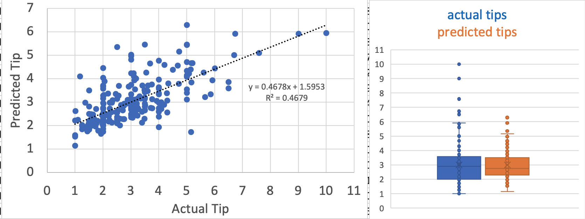

# Data_Analysis_Projects

## [Predicting the restaurant tips using predictive analytics in Excel](Tips_Prediction_Excel/README.md)
  - Objective: To use Excel to predict restaurant tips    
  - Result: __tip = 0.8465 + size\*0.1760 + total_bill\*0.0945__  
  
