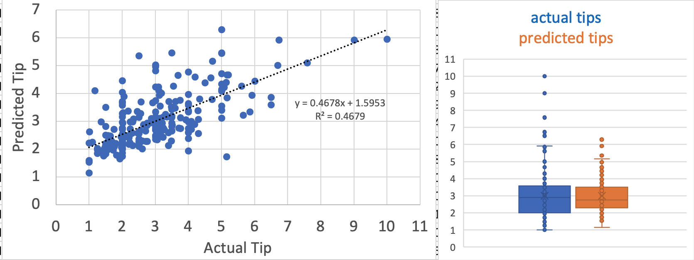

# Data_Analysis_Projects

## [Predicting the restaurant tips using predictive analytics in Excel](ML_LR_EXCEL_Tips_Prediction/README.md)

- Objective: To use Excel to predict restaurant tips    
- Result: __tip = 0.8465 + size\*0.1760 + total_bill\*0.0945__  
  

## [Practice SQL commands using a Employee Records database](SQL_EmployeePerformance/README.md)
- Objective: To document various kinds of SQL queries
- Importance: SQL is a very impactful and ubiquitous database query language. 
- It is very reliable way to store data. We used MySQL here
- Data retrieval is lightening fast! For example in the recent [1 billion row challenge](https://www.morling.dev/blog/one-billion-row-challenge/) although JAVA was the method of choice in programming (with Python being ways behind :( and R was not even in question. [SQL was impressive and the query time was nothing less than stellar](https://rmoff.net/2024/01/03/1%EF%B8%8F%E2%83%A3%EF%B8%8F-1brc-in-sql-with-duckdb/)
_Todo: I need to add an intro to SQL, more commands importantly intro to joins, and my attempt on one-billion-row challenge using R(dplyr and parallels), and Python(numpy, hashing and multithreading) to see how my methods compare _

