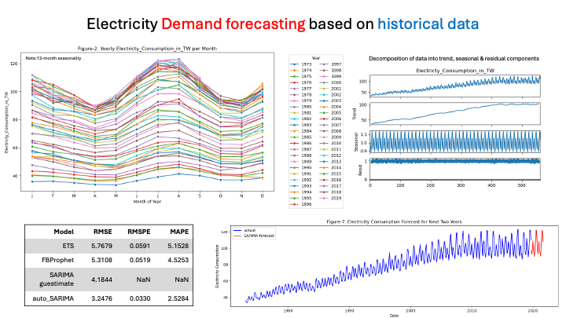

# Data_Analysis_Projects

## [Predicting the restaurant tips using predictive analytics in Excel](ML_LR_EXCEL_Tips_Prediction/README.md)

- Objective: To use Excel to predict restaurant tips    
- Result: __tip = 0.8465 + size\*0.1760 + total_bill\*0.0945__  
  

# [Electricity Demand forecasting](electricity_demand_estimation/Readme.md)
 
__Aim: We need to forecast the next 24 months' demand__  

- Step-1. EDA (there are no nulls :))   
1. Data has an increasing trend (Figure-1)  
2. Monthly data is given to us (Figure-2)  
3. DF test: model is not stationary (EDA table-1)  
4. Multiplicative decomposition works best and decomposes into trend, seasonality and residuals (Figure-3 and Figure-4)  
5. Autocorrelation function (ACF, Figure-5) shows seasonality and tells us that after a lag of 2 years data has an insignificant effect on present.  
6. Partial Autocorrelation function (PACF, Figure-6) also highlights seasonality  

Step-2: Modeling  
__How I see it is that__
- I will use data(-24 months) to fit and predict the last 24 months for which we do have data.  
- Then with the best model, I will create a new fit with all given data using the parameters that best predicted the last 24 months

7. ExponentialSmoothing
8. SARIMA using guestimate based on EDA
9. auto_SARIMA to automatically identify parameters (_hint: best performance_; Figure-7)
10. Prophet by Facebook, worthy competitor

# [Marketing and Ecommerce](marketing_ecommerce/MarketingECommerce.ipynb)
# [cyber security](cyber_security/CyberSecurity.ipynb)
# [Predict Credit Card Consumption](predict_credit_card_consumption/)

