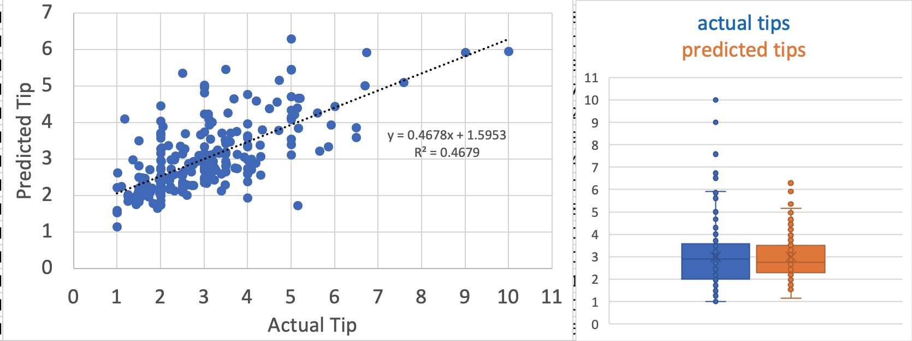
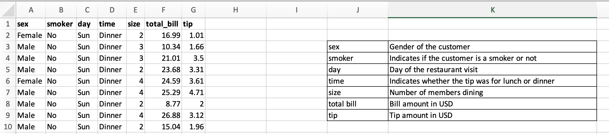
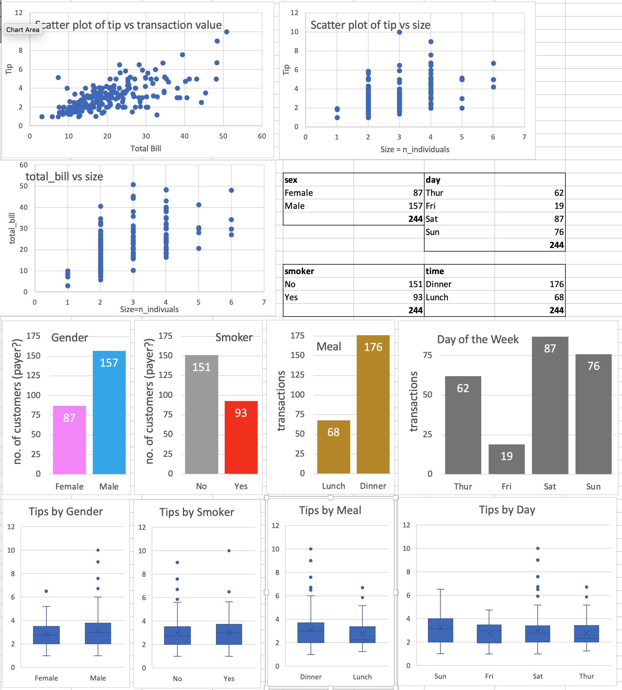
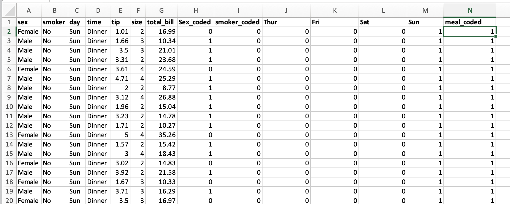
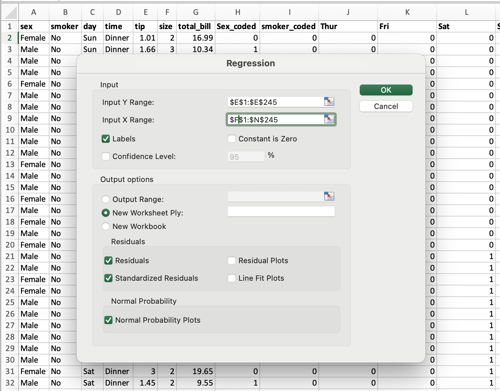
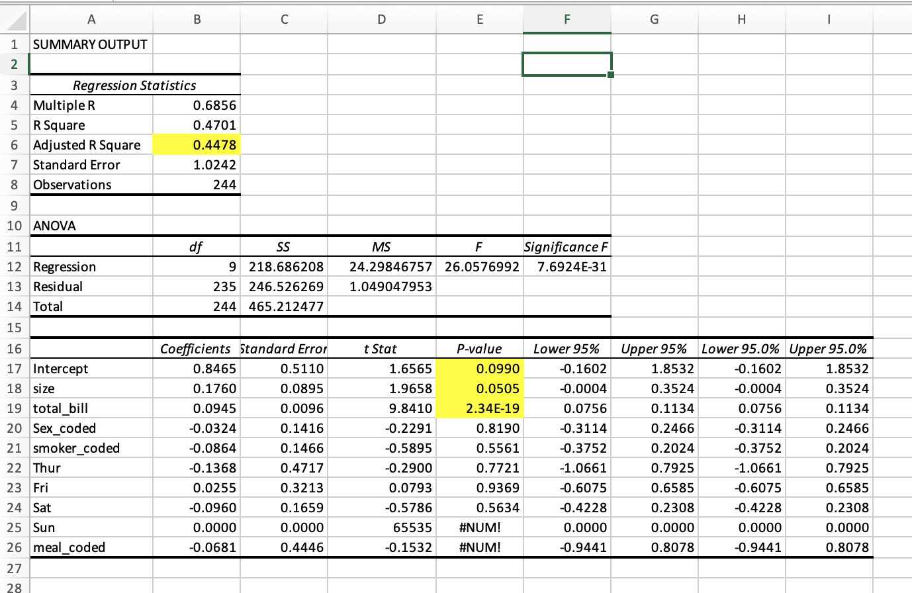
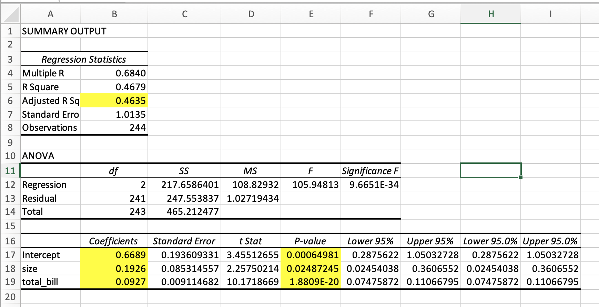
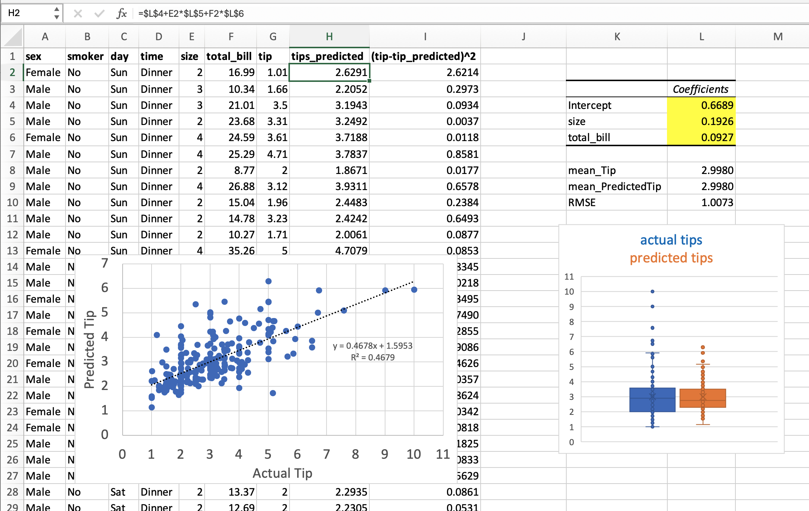

# Predicting the restaurant tips using predictive analytics in Excel
## Objective:
  - To use Excel to predict restaurant tips    
  
### Result: __tip = 0.8465 + size\*0.1760 + total_bill\*0.0945__  

    
  
## Prerequisites  
  - Microsoft Excel
  - Data Analysis Add-in

## Problem Statement and Motivation
  - Model to predict restaurant tips given input values with the mathematical equation for predicting the value of the tips
  
## Tasks - 

### Use the restaurant tips file for the analytics using Excel
 - see attached excel file called "RestaurantTipsDataset_JasvinderAhuja.xlsx"
 - Glimpse of the data in sheet = tips_original
  

### Find out if there are any missing values and clean the data
  - total values are = 244
  - First (on sheet=tips_EDA) I got unique values for each column into the I column using: Data > Advanced > Select List > Copy Unique Values To > "cell for unique values"; where I14="Female"
  - Then I counted the unique values using 
```
      =COUNTIF(A:A,I14)
```
  - There were no missing values and exploratory data analysis (EDA) for the values is as follows-

  - *Note: All column values above sum up-to 244*

### Find out the measures that are independent and dependent
  - Independent variables = sex, smoker, day, time, size, total_bill
  - dependent variable = tip
  - Note: tip seems to increse with total_bill and with size in above EDA
  - We will need to code and model sex, smoker, day and time for further analysis

### Identify which predictive problem is needed
  - We need multiple regression to predict tips as there are at least 2 variable that seem to affect tips (total_bill and size)
  - For categorical variables (gender, smoker, meal and day) we dont see any distinct pattern but we may be missing it or it may be acting as a compounding factor with some other variable. 
  - So for the first round of predictive analysis we will use all the variables.

### Encode the categorical variables to numeric using IF conditions
  - I inserted "tip" column before size to separate the dependent variable from independent variable inputs. So that the independent variables (coded) can be fed to the analysis as a contiguous range in the next section.
  - **Gender, Smoker and Meal have only two categories therefore will be coded as 0 or 1
  - ** Day of the Week has four catogories therefore needs to be coded into four columns using one-hot encoding. **
  - let me explain. 
      - If we code as 0,1,2,3 for Thur, Fri, Sat and Sun; then whatever coefficient (m~d~) we get will need to be linearly correlated to day!!! for example if coeff = m~d~ then it becomes = 0+Fri\*m~d~+Sat\*2m~d~+Sun\*3m~d~
      - Instead we need = Thu\*m~Thu~ + Fri\*m~Fri~+Sat\*m~Sat~+Sun\*m~Sun~ 
_Note: one of these variables we created for day is dependent on all other variables. e.g. if we know that a day is not Thursday, Friday or Saturday - It has to be Sunday! _       

  - I manually typed - J1=Thur, K1=Fri, L1=Sat and M1=Sun. In this setup only one of these four columns would be 1 and others would be set to 0.
  - Here are the formula for coding using if (refer sheet = tip_encoding)  
     _I like to encode both options with IFS to be sure_


```
H2 = IFS(A2="Female",0,A2="Male",1)
I2 = IFS(B2="No",0,B2="Yes",1)
J2 = IF($C2=J$1,1,0)
K2 = IF($C2=K$1,1,0)
L2 = IF($C2=L$1,1,0)
M2 = IF($C2=M$1,1,0)
N2 = IFS(D2="Lunch",0,D2="Dinner",1)
```
 - another concern was whether to get a zscore for total_bill and size. $$Z = (X - μ) / σ $$ Doing this did not improve the model (not shown) and complicated the analysis in excel for this task. Therefore, I went without scaling the values. _Please share if anyone has strong contrary opinions on this aspect._
 - Glimpse of encoded values 


### Build an appropriate model with the dataset
 - We need the data analysis tool pack as follows-  
    - [For mac - 1 min video](https://www.youtube.com/watch?v=fxRyunAQR48)  
    - [For PC - 1 min video](https://www.youtube.com/watch?v=LZnBlQKZVdY)  
 - to build a regression model with Data Analysis toolpack (Mac) -
    1. goto "Data" tab
    2. Click "Data Analysis"
    3. Choose "Regression"
    4. Y range is the dependent variable and X range are the coded independent variables. And, it simplifies our interpretation if we have the labels for our columns. 
  


    5. This way we get a new sheet (Analysis_1)
    
        - Adjusted R Square of 0.4478 predicts a weak model  
        - significant P values (less than 0.05) are-  
            - Intercept _P-value_ 0.0990   
            - size = 0.0505  
            - total_bill = 2.34*E-19  
            ** the other variables including Sex, smoker, Thur, Fri, Sat, Sun and meal have very low confidence P-value >> 0.05 and we should ignore them.**  
            - Ignoring those variables calls for a new analysis.  
            
   
[Analysis Output - explaination video](https://www.statisticshowto.com/probability-and-statistics/excel-statistics/excel-regression-analysis-output-explained/)   \n  


####    6. Redo analysis (Analysis_2) using significant variables  
  - using only the two important variables total_bill and size   

.  


  - The adjusted R Square has improved a bit. Telling us that this is a better model than previous.  
  - _P-values_ have also improved a bit.  
__Now our equation using these coefficients is - __  
  __tip = 0.8465 + size\*0.1760 + total_bill\*0.0945__  

### Calculate the predicted and actual tips values
  - Using the above formula now we can predict the tips
  - In the sheet tips_PredictionAnalysis 

```
H1 = $L$4+E2*$L$5+F2*$L$6
```

### Calculate the RMSE(Root Mean Square Error) of the model. 
  - RMSE is the root of the mean of square errors.
The Root Mean Square Error (RMSE) is a measure of the differences between values predicted by a model or estimator and the observed values. It is calculated as:

$$ \text{RMSE}(y, \hat{y}) = \sqrt{\frac{\sum_{i=0}^{N - 1} (y_i - \hat{y}_i)^2}{N}} $$

For this analysis the RMSE = 1.0073
```
I2 = =(G2-H2)^2
RMSE = SQRT(SUM(I2:I245)/COUNTA(I2:I245))

```
. 


